# Accent / branding exploration — warm amber accent

Status: **exploration, not for merge.** This documents the visual case for step 3 of
the frontend design review (re-hueing `--accent`). Steps 1, 2, and 4 are tracked
separately as issues #1169, #1170, #1171. Screenshots are the live `/demo` list with
the accent tokens swapped at runtime — no code change was shipped to produce them.

## The problem being solved

`--accent` currently changes hue per theme: **blue-600 in light, red-400 in dark,
blue-800 in e-paper.** Links (`TextLink` → `text-accent`) and unread dots
(`bg-accent-muted dark:bg-accent`) both ride on it. Consequences:

1. **No brand identity** — there's no single "Lion Reader colour"; the accent is a
   different hue in each theme.
2. **Dark-mode collision** — the accent is `red-400`, the _same_ value as error text.
   In dark mode an unread dot, a hyperlink, and an error are indistinguishable by
   colour.
3. **Brand disconnect** — the lion is warm (orange/teal); the UI accent is cool
   blue/zinc. The brand appears nowhere in the chrome. The one warm thing (the amber
   star) is un-tokenized drift, not a decision.

## Why warm (amber), specifically

The **extreme-low-blue-light dark mode is a product feature** (user comfort over
branding). That constraint _is_ the decision:

- **Teal is disqualified** for the dark theme — it carries blue, which the low-blue
  goal exists to avoid.
- **Amber is fully low-blue-light** — it sits ~590 nm, as far from the blue band
  (~470 nm) as red does. Swapping the dark-mode accent from red to amber costs
  **nothing** on the low-blue axis while removing the error-collision.
- Amber is warm and lion-adjacent, so it finally puts the brand in the product, and
  the existing amber star stops being an orphan — dots and star become one family.

The one honest tradeoff: a warm accent crowds the warm end of the _status_ palette
(warning=amber, danger=red). Mitigate by pushing warning toward yellow, keeping
danger clearly red, and leaning on the fact that status colours appear as
icon+bordered-subtle-boxes while the accent appears as dots/links/fills — different
shapes and contexts, so hue proximity matters less.

Contrast note: amber fails WCAG AA as **text on white**, so link _text_ uses a deep
tone (`amber-800`/`amber-700`, AA-safe) while dots/fills/star/focus use vivid
`amber-500/600`. The two roles are already separate tokens (`--accent` vs
`--accent-muted`), so this is expressible without a new mechanism.

## Before / after

### Light

| Current (blue)             | Amber                    |
| -------------------------- | ------------------------ |
| 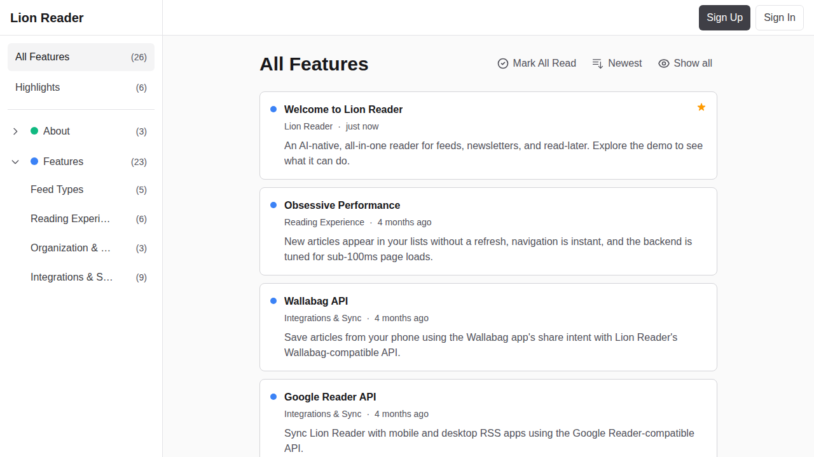 | 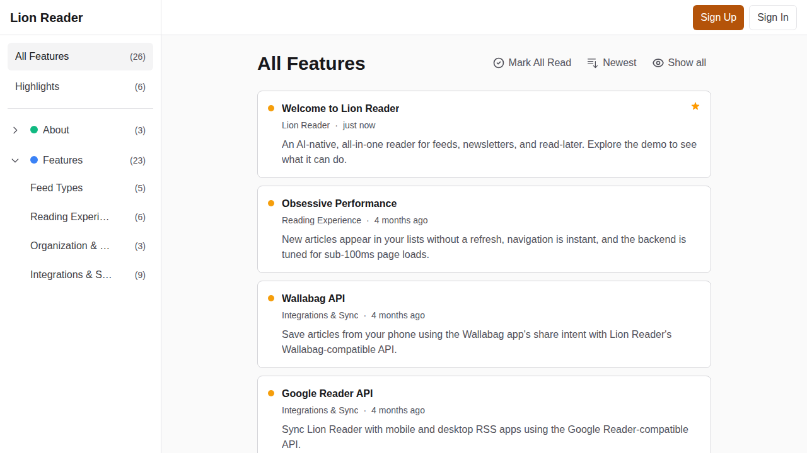 |

### Dark — the decisive one (low-blue-light)

Red dots read as _alarms_; amber-gold dots read as _calm_, at identical low-blue-light
cost, and no longer collide with error-red.

| Current (red)             | Amber                   |
| ------------------------- | ----------------------- |
| 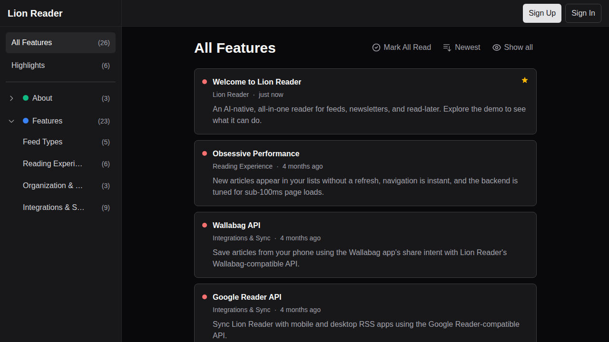 | 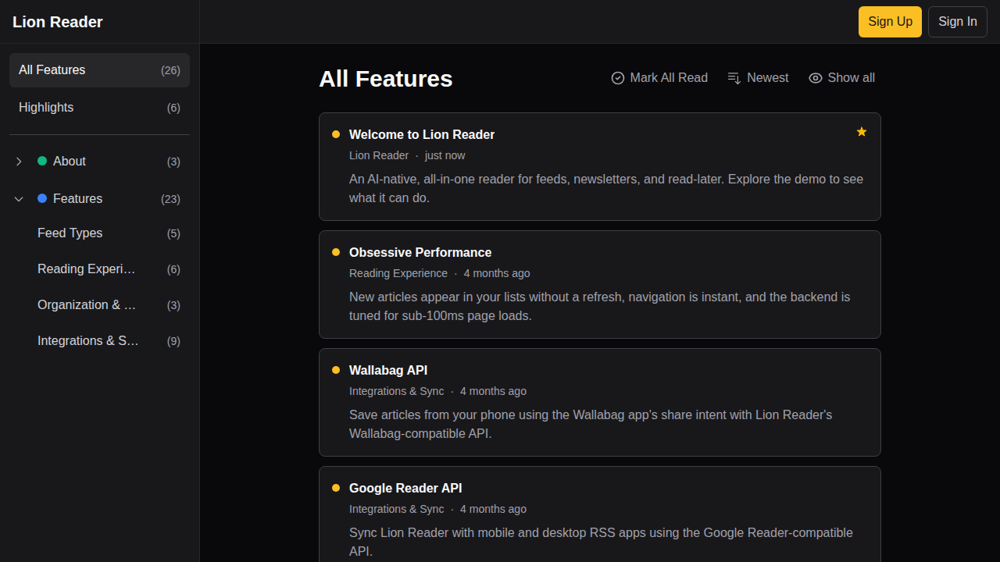 |

### E-paper

Greys kept **cool/neutral** (not warmed — warm greys clip to the same monochrome and
hurt reviewability). Only the accent carries colour, biased dark (`amber-800`) so it
grays to a clearly-dark tone and survives an e-ink monochrome conversion. Near-identical
to today on a normal screen.

| Current (dark blue)         | Amber (dark rust)         |
| --------------------------- | ------------------------- |
| 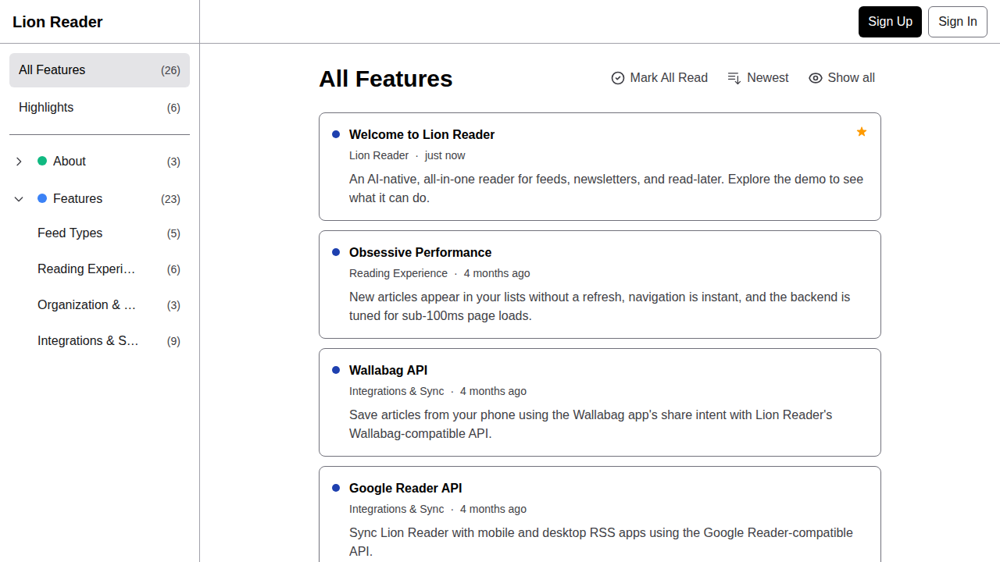 | 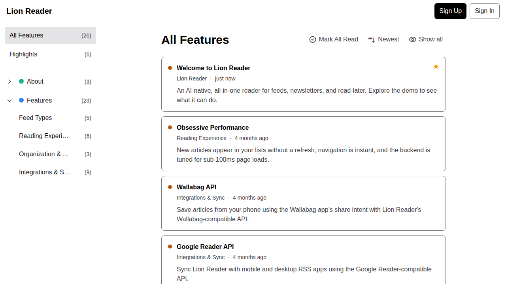 |

## Links in an open entry

Prose links are bound to `--accent` (confirmed at runtime — no `--tw-prose-links`
override needed), so re-hueing the accent moves them automatically. This is where the
dark-mode collision bites hardest: today an in-body hyperlink is `red-400`, so it reads
like an error or a strikethrough mid-sentence.

### Light — link text uses the AA-safe `amber-700` (≈4.5:1 on white)

| Current (blue)                        | Amber (burnt)                       |
| ------------------------------------- | ----------------------------------- |
| 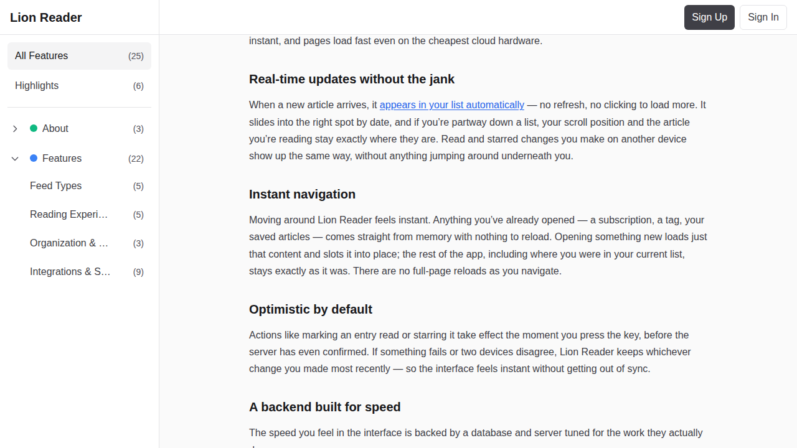 | 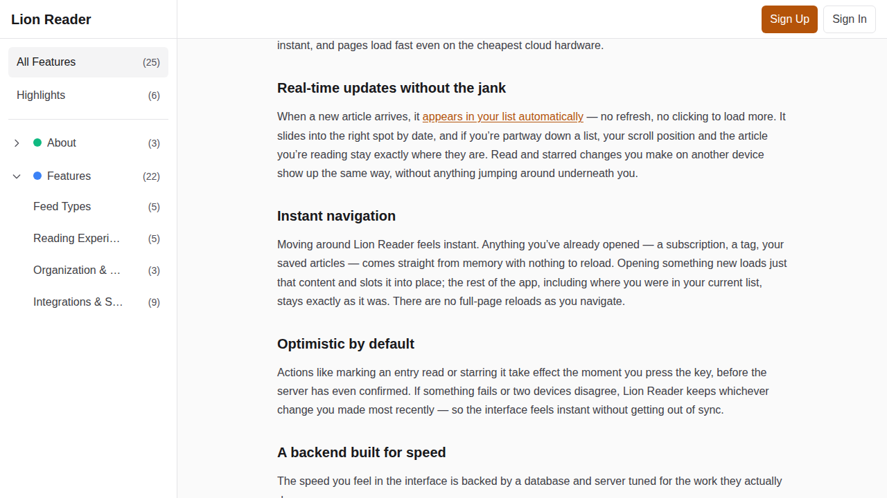 |

### Dark — red "error" link → amber "link"

| Current (red)                        | Amber                              |
| ------------------------------------ | ---------------------------------- |
| 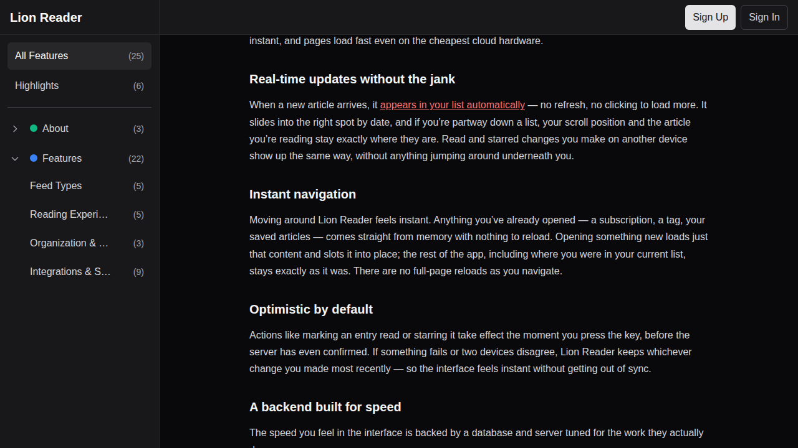 | 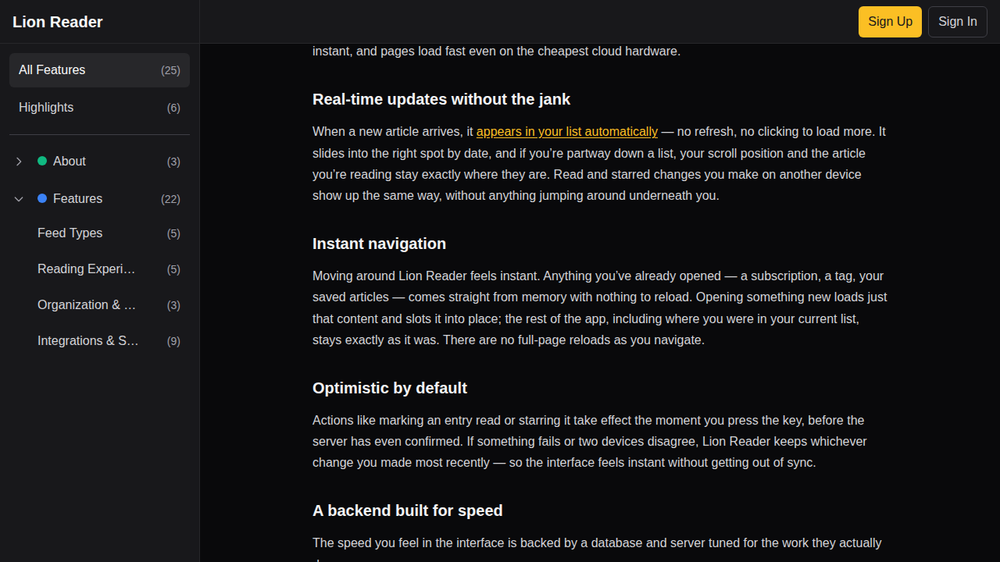 |

## AI summary card & settings — deliberately _not_ re-hued

The summary card already rides on the tokenized `--info` (blue) role, not raw colour:

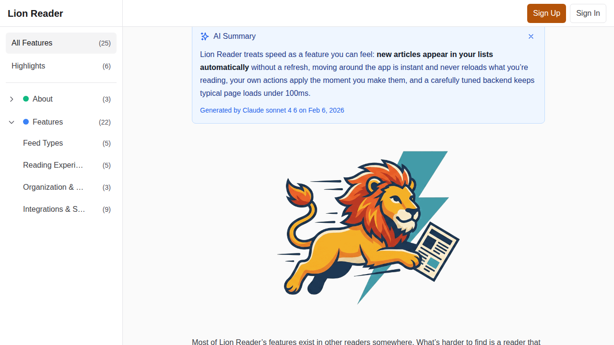

Leaving it blue is a feature, not an oversight. With a warm brand accent, a **blue
"assistant" box is now clearly differentiated** from the amber chrome — it reads as
"informational / machine-generated," distinct from interactive amber and neutral
surfaces. Giving AI its own hue (the common violet/purple convention) would add a
fourth colour family to an already warm+cool+status palette; `--info` blue does the job.

**Settings pages need no separate redesign.** They're built from `SettingsSection` +
`Card` + the neutral tokens, so they inherit the accent re-hue automatically (selected
rows, focus rings, primary buttons, toggles → amber) and the status-token cleanup in
#1169 (the amber warning notes / green success states scattered in narration, API-token,
and OPML settings all collapse onto the new `--warning`/`--success` tokens). The one
thing to verify is the **warning-vs-accent amber proximity** in settings notes — that's
the argument for nudging `--warning` toward yellow (open question below).

## Proposed accent tokens (illustrative values used above)

```css
:root {
  /* light */
  --accent: #b45309; /* amber-700 — AA-safe link text */
  --accent-hover: #92400e; /* amber-800 */
  --accent-muted: #f59e0b; /* amber-500 — unread dots / vivid fills */
  --accent-subtle: #fffbeb; /* amber-50 */
  --accent-subtle-foreground: #92400e;
  --accent-border: #fde68a; /* amber-200 */
  /* fold selected/focus into the brand */
  --focus: #b45309;
  --control-selected: #b45309;
  /* branded primary CTA */
  --primary-solid: #b45309;
  --primary-solid-foreground: #ffffff;
}
.dark {
  --accent: #fbbf24; /* amber-400 — low-blue, distinct from danger red-400 */
  --accent-hover: #fcd34d; /* amber-300 */
  --accent-muted: #f59e0b; /* amber-500 — dots */
  --accent-subtle: rgba(120, 53, 15, 0.25);
  --accent-subtle-foreground: #fde68a;
  --accent-border: #92400e;
  --focus: #fbbf24;
  --control-selected: #fbbf24;
  --primary-solid: #fbbf24;
  --primary-solid-foreground: #18181b;
}
.epaper {
  --accent: #92400e;
  --accent-hover: #78350f;
  --accent-muted: #b45309;
  --accent-subtle: #fef3c7;
  --accent-subtle-foreground: #78350f;
  --accent-border: #d97706;
  /* greys stay cool; primary stays pure black */
}
```

## Logo

We're already considering redesigning the mark (book → newspaper). That **frees the
accent**: rather than reverse-engineering the accent from the current orange lion,
pick amber on the UX merits (low-blue + contrast-workable + brand-warm) and design the
new mark to _it_. A newspaper masthead is mostly greyscale halftone, which pairs
naturally with a mostly-neutral UI carrying a single warm accent — arguably a better
fit than the multi-colour book cover.

## Open questions for review

- Amber-700 vs a more orange burnt tone for light-mode link text — taste call.
- Warning hue: shift to yellow to separate it from the amber accent?
- Should `--primary-solid` become the accent (branded CTA), or stay neutral zinc?
